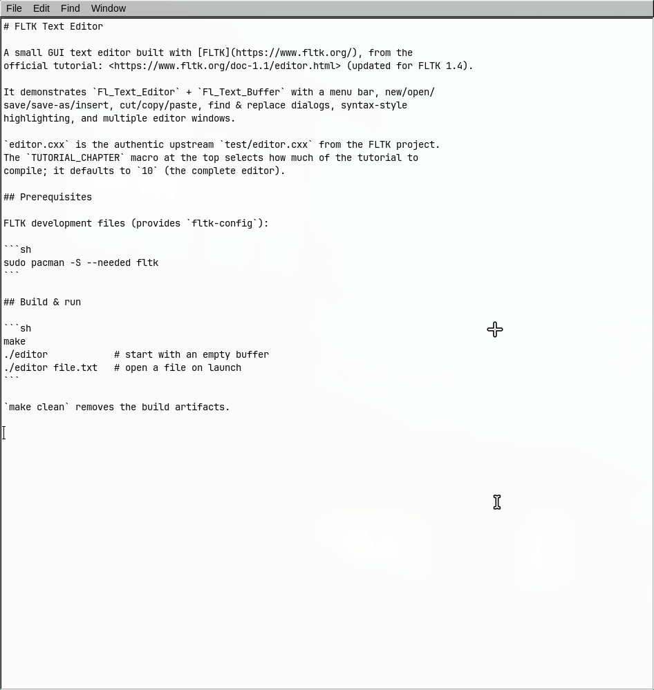

# FLTK Text Editor



A small GUI text editor built with [FLTK](https://www.fltk.org/), from the
official tutorial: <https://www.fltk.org/doc-1.1/editor.html> (updated for FLTK 1.4).

It demonstrates `Fl_Text_Editor` + `Fl_Text_Buffer` with a menu bar, new/open/
save/save-as/insert, cut/copy/paste, find & replace dialogs, syntax-style
highlighting, and multiple editor windows.

`editor.cxx` is the authentic upstream `test/editor.cxx` from the FLTK project.
The `TUTORIAL_CHAPTER` macro at the top selects how much of the tutorial to
compile; it defaults to `10` (the complete editor).

## Prerequisites

FLTK development files (provides `fltk-config`):

```sh
sudo pacman -S --needed fltk
```

## Build & run

```sh
make
./editor            # start with an empty buffer
./editor file.txt   # open a file on launch
```

`make clean` removes the build artifacts.
